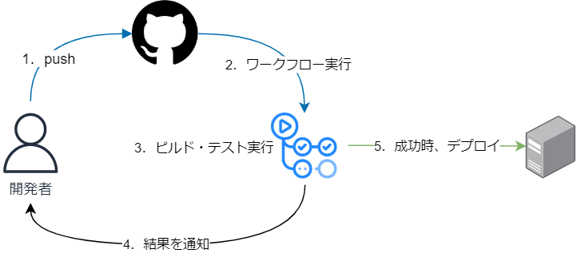

# CI/CDとは
CI(継続的インテグレーション)とは、コードレベルのテストまでを自動化する。  
CD(継続的デリバリー)とは、システムテストやデプロイなど、実行環境やリリースまで影響するような自動化を行うのがCD。

## メリット
- 自動化により開発期間を短縮できる
- コードのバグを早期に発見できる
- コードの品質がある程度担保される
- デプロイ時の人的ミスや属人化を防ぐことができる

## デメリット
- 導入コストが高い
- 頻繁にテストやリリースを行わない開発には向いていない

## 主に使用されているツール
- Jenkins
- CircleCI
- GitHub Actions

### オンプレミス型
特徴
- 拡張性が高い
- 運用コストが高い
- サーバーを自前で用意する必要がある

### クラウド型
特徴
- 拡張性が低い
- 導入が容易

## 流れ

### 参考
- [CI/CDとは？メリット・デメリットからちゃんと理解していく \| yukimasablog](https://yukimasablog.com/ci-cd)
- [CI/CDのエキスパートが解説：CI/CDとは何か？ なぜ今、必要とされるのか？ \(1/3\)：CodeZine（コードジン）](https://codezine.jp/article/detail/11083)