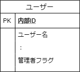
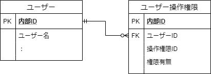
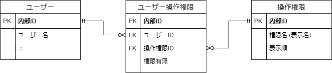
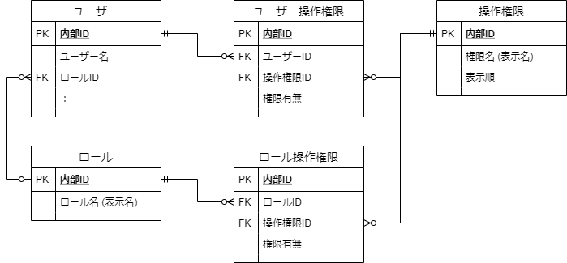
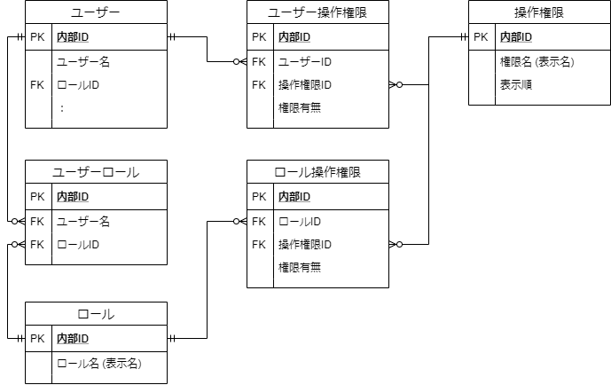

# システムのアクセス制御 (操作権限管理) 設計
このページは、システムのアクセス制御 (ユーザーの操作権限管理の仕組み) について考えるページです。

- [システムのアクセス制御 (操作権限管理) 設計](#システムのアクセス制御-操作権限管理-設計)
  - [権限の方式](#権限の方式)
    - [1\. 管理者フラグ方式](#1-管理者フラグ方式)
      - [データモデルの例](#データモデルの例)
      - [データの例](#データの例)
      - [適用前提・利点・欠点](#適用前提利点欠点)
    - [2\. ユーザー操作権限方式](#2-ユーザー操作権限方式)
      - [データモデルの例](#データモデルの例-1)
      - [データの例](#データの例-1)
      - [適用前提・利点・欠点](#適用前提利点欠点-1)
      - [データ・画面・処理の移行 (「1. 管理者フラグ方式」から)](#データ画面処理の移行-1-管理者フラグ方式から)
    - [3\. ユーザー操作権限方式 + 操作権限マスタ](#3-ユーザー操作権限方式--操作権限マスタ)
      - [データモデルの例](#データモデルの例-2)
      - [データの例](#データの例-2)
      - [適用前提・利点・欠点](#適用前提利点欠点-2)
      - [データ・画面・処理の移行 (「2. ユーザー操作権限方式」から)](#データ画面処理の移行-2-ユーザー操作権限方式から)
    - [4\. 単一ロール方式](#4-単一ロール方式)
      - [データモデルの例](#データモデルの例-3)
      - [データの例](#データの例-3)
      - [適用前提・利点・欠点](#適用前提利点欠点-3)
      - [データ・画面・処理の移行 (「3. ユーザー操作権限方式 + 操作権限マスタ」から)](#データ画面処理の移行-3-ユーザー操作権限方式--操作権限マスタから)
    - [5\. 複数ロール方式](#5-複数ロール方式)
      - [データモデルの例](#データモデルの例-4)
  - [参考](#参考)

## 権限の方式
### 1\. 管理者フラグ方式
管理者フラグ方式は、管理ユーザーと一般ユーザーを判別するために使用する単純な方式です。

#### データモデルの例

#### データの例
| 内部ID | ユーザー名 | …    | 管理者フラグ |
| :----- | :--------- | :--- | :----------- |
| 1      | admin      | …    | 1            |
| 2      | user1      | …    | 0            |
| 3      | user2      | …    | 0            |

データの例 (ユーザー)。管理者フラグ = 1 であれば管理者

#### 適用前提・利点・欠点

| 項目     | 説明                                                                                                                                                                                                                                                                                                                                                                         |
| :------- | :--------------------------------------------------------------------------------------------------------------------------------------------------------------------------------------------------------------------------------------------------------------------------------------------------------------------------------------------------------------------------- |
| 適用前提 | ・一般ユーザーと管理者ユーザー (システム管理用ユーザー) だけでも分けたい場合                                                                                                                                                                                                                                                                                                 |
| 利点     | ・シンプル ・テーブル、画面 (ユーザー管理画面、実際のアクセス制御をする画面) とも作成が簡単　 例: ユーザー編集画面で「管理者」というチェック項目を設けるだけで設定が済む　 例: アクセス制御をする画面でログイン中のユーザーの管理者フラグを見るだけで制御が済む　 例: 「管理者フラグ付きのユーザーは業務画面に表示するユーザー一覧には表示しない」などがしやすい |
| 欠点     | ・「このユーザーにはこの操作だけ許可したい」ということができない (管理者にするとシステム上の全管理権限を与える形になってしまう)                                                                                                                                                                                                                                              |

### 2\. ユーザー操作権限方式
ユーザー操作権限方式は、ユーザーに個別に操作権限を付与する方式です。  
(ロール (role) を作らず、ユーザーと操作権限 (permission) の紐づけのみ行う。操作権限マスタはいったん作らない)

#### データモデルの例

#### データの例

| 内部ID | ユーザー名 | …    |
| :----- | :--------- | :--- |
| 1      | admin      | …    |
| 2      | user1      | …    |
| 3      | user2      | …    |
データの例 (ユーザー)

| 内部ID | ユーザーID | 操作権限ID           | 権限有無 |
| :----- | :--------- | :------------------- | :------- |
| 1      | 1 (admin)  | 1 (例: ユーザー管理) | 1 (有)   |
| 2      | 1 (〃)     | 2 (例: ○○登録)       | 1 (有)   |
| 3      | 1 (〃)     | 3 (例: システム設定) | 1 (有)   |
| 4      | 2 (user1)  | 1 (例: ユーザー管理) | 0 (無)   |
| 5      | 2 (〃)     | 2 (例: ○○登録)       | 1 (有)   |
| 6      | 2 (〃)     | 3 (例: システム設定) | 0 (無)   |

データの例 (ユーザー操作権限)。データが無い場合は 権限有無 = 0 (無) として扱っても可
#### 適用前提・利点・欠点
| 項目     | 説明                                                                                                                                                                                                                                                                                                                                                                           |
| :------- | :----------------------------------------------------------------------------------------------------------------------------------------------------------------------------------------------------------------------------------------------------------------------------------------------------------------------------------------------------------------------------- |
| 適用前提 | ・ユーザーごとに操作権限を割り当てたい場合 ・操作権限の種類がそれほど多くない場合 (数個など) ・操作権限のIDや表示名などはシステム上 (定数など) で管理できる場合                                                                                                                                                                                                          |
| 利点     | ・管理者フラグ方式の欠点が解消できる (個別に操作権限を付与できる) ・最初からロールを作るより移行がしやすい (ロールを用意するとロール管理やロールに何の操作権限があるのかの設定が必要になる。→ 画面作成などの工数が増える) ・ユーザー操作権限を作ったあとでロールを作れば「このユーザーはこのロールだけど特別にこの操作を許可したい」のような例外的な操作を実現させやすい |
| 欠点     | ・操作権限を増やしたい場合、定数や画面項目を都度追加する必要がある (工数が若干かかる) ・操作権限が多くなってくる (10 以上など) と管理が面倒 ・複数のユーザー作成時に「一度に同じような複数の権限を設定したい」というケースでも1つずつ操作権限を設定しないといけないので使いづらい                                                                                        |

#### データ・画面・処理の移行 (「1. 管理者フラグ方式」から)

| 項目             | 説明                                                                                                                                                                                                         |
| :--------------- | :----------------------------------------------------------------------------------------------------------------------------------------------------------------------------------------------------------- |
| データの移行     | ・操作権限の種類を整理し、IDを振っておく ・[ユーザー].[管理者フラグ] を消す ・ユーザー個別権限テーブルを追加する ・管理者フラグが付与されていたユーザーにユーザー個別権限テーブル上で全権限を与える |
| 画面・処理の移行 | ・ユーザー編集画面の管理者フラグ用のチェックを消す ・操作権限の個数分、チェック項目を増やす ・管理者フラグを見てアクセス制御していた処理をユーザー操作権限を見るように変更する                         |

### 3\. ユーザー操作権限方式 + 操作権限マスタ
ユーザー操作権限方式の欠点を一部解消するため、操作権限マスタを用意する方式です。

#### データモデルの例

#### データの例
※ ユーザー、ユーザー操作権限のデータは「2. ユーザー操作権限方式」と同じです。

| 内部ID | 権限名 (表示名) | 表示順 |
| :----- | :-------------- | :----- |
| 1      | ユーザー管理    | 1      |
| 2      | ○○登録          | 2      |
| 3      | システム設定    | 3      |

データの例 (操作権限)

-   補足
    -   「表示順」はユーザー編集画面の権限設定項目に表示する順番です。(無くても可。ORDER BY に使える)

#### 適用前提・利点・欠点
※ 基本的に「2. ユーザー操作権限方式」と同じです。

| 項目 | 説明                                                                                                    |
| :--- | :------------------------------------------------------------------------------------------------------ |
| 利点 | ・操作権限を増やしたい場合、「2. ユーザー操作権限方式」に比べて DB 上のデータを増やす程度で対応ができる |

#### データ・画面・処理の移行 (「2. ユーザー操作権限方式」から)
| 項目             | 説明                                                                                                     |
| :--------------- | :------------------------------------------------------------------------------------------------------- |
| データの移行     | ・操作権限マスタテーブルを追加する ・定数などで管理していた操作権限を操作権限マスタテーブルに追加する |
| 画面・処理の移行 | ・ユーザー編集画面の操作権限表示を操作権限マスタテーブルのデータをもとに行うようにする                   |

### 4\. 単一ロール方式
単一ロール操作権限方式は、ユーザーに1つのロール (役割。操作権限の一括設定) を付与する方式です。  
主にユーザー操作権限の欠点 (「操作権限が多くなってくる (10 以上) と管理が面倒」) を解消します。

#### データモデルの例

-   補足
    -   「2. ユーザー操作権限方式」の操作権限マスタと同様、ロールの数が少なければ最初はロールをシステム上の定数などで管理してもよいです。

#### データの例

| 内部ID | ユーザー名 | **ロールID** | …    |
| :----- | :--------- | :----------- | :--- |
| 1      | admin      | 1            | …    |
| 2      | user1      | 2            | …    |
| 3      | user2      | NULL         | …    |

データの例 (ユーザー)。ロールIDを追加

| 内部ID | ユーザーID | 操作権限ID           | 権限有無           |
| :----- | :--------- | :------------------- | :----------------- |
| 1      | 1 (admin)  | 1 (例: ユーザー管理) | **2 (ロール優先)** |
| 2      | 1 (〃)     | 2 (例: ○○登録)       | **2 (ロール優先)** |
| 3      | 1 (〃)     | 3 (例: システム設定) | **2 (ロール優先)** |
| 4      | 2 (user1)  | 1 (例: ユーザー管理) | **2 (ロール優先)** |
| 5      | 2 (〃)     | 2 (例: ○○登録)       | **2 (ロール優先)** |
| 6      | 2 (〃)     | 3 (例: システム設定) | **2 (ロール優先)** |

データの例 (ユーザー操作権限)。権限有無に「ロール優先」という区分を追加。必要な場合個別設定する

| 内部ID | ロール名 (表示名) |
| :----- | :---------------- |
| 1      | システム管理者    |
| 2      | ○○管理者          |

データの例 (ロール)

| 内部ID | ロールID           | 操作権限ID           | 権限有無 |
| :----- | :----------------- | :------------------- | :------- |
| 1      | 1 (システム管理者) | 1 (例: ユーザー管理) | 1 (有)   |
| 2      | 1 (〃)             | 2 (例: ○○登録)       | 1 (有)   |
| 3      | 1 (〃)             | 3 (例: システム設定) | 1 (有)   |
| 4      | 2 (○○管理者)       | 1 (例: ユーザー管理) | 0 (無)   |
| 5      | 2 (〃)             | 2 (例: ○○登録)       | 1 (有)   |
| 6      | 2 (〃)             | 3 (例: システム設定) | 0 (無)   |

データの例 (ロール操作権限)

#### 適用前提・利点・欠点

| 項目     | 説明                                                                                                  |
| :------- | :---------------------------------------------------------------------------------------------------- |
| 適用前提 | ・設定したい操作権限が多く、操作権限グループとしてのロールが実務上必要な場合                          |
| 利点     | ・ユーザー操作権限方式の欠点が解消できる (ユーザーに一度に同じような複数の権限を役割として設定できる) |
| 欠点     | ・画面が必要な場合工数がかかる ・テーブル数の増加、概念の増加 (優先) などで処理が複雑になる        |

#### データ・画面・処理の移行 (「3. ユーザー操作権限方式 + 操作権限マスタ」から)

| 項目             | 説明                                                                                                                                                                                                                                                                                                  |
| :--------------- | :---------------------------------------------------------------------------------------------------------------------------------------------------------------------------------------------------------------------------------------------------------------------------------------------------- |
| データの移行     | ・ロール、ロール操作権限テーブルを追加する ・ユーザー操作権限のデータを「ロール優先」になるよう変更し、従来管理していた権限と同じ意味合いを保ってロールやロール操作権限テーブルにデータを追加する ・ユーザーにロールID列を追加し、ユーザーに適切なロールIDを設定する                            |
| 画面・処理の移行 | ・ロール管理画面を作成する (一覧、登録、編集、削除。ロールの登録・編集画面内にロール操作権限設定部分を作る) ・ユーザー編集画面でユーザー操作権限のチェックを「ON」「OFF」「ロール優先」の3通りの指定ができるようにプルダウンなどに変更する ・アクセス制御の処理をロールも考慮するように変更する |

### 5\. 複数ロール方式
複数ロール方式は、ユーザーに複数のロールを付与する方式です。

#### データモデルの例

## 参考
-   [システムのアクセス制御 \(操作権限管理\) 設計 \| knooto](https://knooto.info/software-design-access-control/)