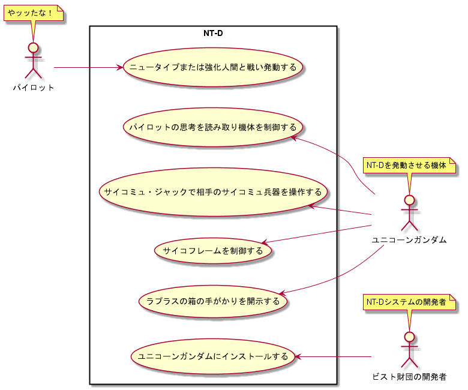

~~~puml
@startuml
left to right direction
actor パイロット as P
actor ビスト財団の開発者 as B
actor ユニコーンガンダム as U

rectangle NT-D {
P -r-> (ニュータイプまたは強化人間と戦い発動する)
U -l-> (パイロットの思考を読み取り機体を制御する)
U -l-> (サイコミュ・ジャックで相手のサイコミュ兵器を操作する)
U -l-> (サイコフレームを制御する)
U -l-> (ラプラスの箱の手がかりを開示する)
B -l-> (ユニコーンガンダムにインストールする)
}

note top of P : やッッたな！
note top of U : NT-Dを発動させる機体
note top of B : NT-Dシステムの開発者

@enduml
~~~

### ユースケースシナリオ
|     項目名     | 内容                                                         |
| :------------: | :----------------------------------------------------------- |
| ユースケース名 | ニュータイプまたは強化人間と戦い発動する                     |
|      概要      | パイロットがニュータイプまたは強化人間と戦い、NT-Dが発動する |
|   主アクター   | パイロット                                                   |
|    事前条件    | 機体に搭乗し戦闘状態であること                               |
|    事後条件    | 機体がユニコーンモードに変形する                             |
|    関連情報    | なし                                                         |
|      備考      | なし                                                         |

#### メインフロー（主な流れ）
1. パイロットが機体に搭乗
2. 敵機と戦闘
3. 敵パイロットががニュータイプまたは強化人間と分かる
4. NT-Dが発動し機体性能が上がる
5. パイロットが敵機を撃破するまでNT-Dが継続される
6. 敵機が撃破されたらNT-Dが終了する
7. 機体がユニコーンモードに変形する
8. 機体性能が戻る
9. 戦闘終了

#### 代償フロー（メインフロー以外の流れ）
1. 敵パイロットがニュータイプまたは強化人間ではない場合、発動しない
2. NT-Dが発動しそうだがパイロットが抵抗した場合、発動しない
   1. 敵機がNT-Dを発動させた場合、強制的に発動される
3. パイロットが操縦不能もしくは戦意喪失した場合、発動しないまたは停止する
4. 慣れてくるとパイロットが任意で発動できる

|     項目名     | 内容                                                                   |
| :------------: | :--------------------------------------------------------------------- |
| ユースケース名 | ラプラスの箱の手がかりを開示する                                       |
|      概要      | ユニコーンガンダムがラプラスの箱の手がかりをNT-Dが開示する             |
|   主アクター   | ユニコーンガンダム                                                     |
|    事前条件    | 特定の場所でユニコーンガンダムに搭乗したニュータイプがNT-Dを発動させる |
|    事後条件    | ラプラスの箱の手掛かりとなるデータが開示される                         |
|    関連情報    | なし                                                                   |
|      備考      | なし                                                                   |

#### メインフロー（主な流れ）
1. ニュータイプが機体に搭乗
2. 特定の場所へ移動
3. NT-Dを発動させる
4. ラプラスの箱の手掛かりが開示

#### 代償フロー（メインフロー以外の流れ）
1. 特定の場所以外でNT-Dが発動した場合、情報は開示しない
2. ニュータイプではなかった場合、情報は開示しない
