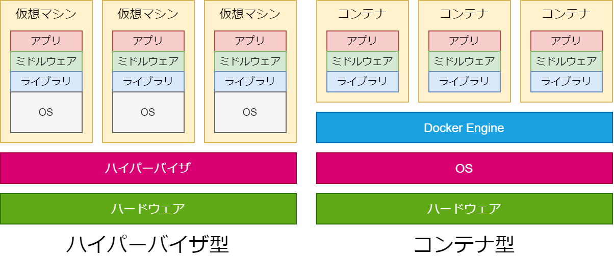

- [Dockerとは](#dockerとは)
    - [コンテナ型](#コンテナ型)
      - [コンテナ仮想化のメリット](#コンテナ仮想化のメリット)
      - [特徴](#特徴)
    - [コンテナイメージとは](#コンテナイメージとは)
    - [コンテナランタイムとは](#コンテナランタイムとは)
    - [コンテナレジストリとは](#コンテナレジストリとは)

# Dockerとは
Docker社が開発している、コンテナ型の仮想環境を作成、配布、実行するためのプラットフォーム。
コンテナ型のアプリケーション実行環境のこと。Linux上で動作する。（WindowsやMacでは裏でLinuxの仮想環境が構築されている）

[Dockerハンズオン](https://shimo5.me/post/2020-09-07/)

### コンテナ型

現在の主流。アプリケーション・ミドルウェア・OSなどのインフラ環境を一つのコンテナとしてまとめる。それぞれのコンテナがホストOSを共有して稼働するため、他の仮想化と比べるとサーバの起動や処理なども高速。ホストOSと異なるOSのコンテナを作ることができない。

仮想化ソフトウェアの例：Dockerなど

#### コンテナ仮想化のメリット

- ビルド、デプロイも高速
- オーバーヘッドが少ない
- プラットフォームやハードウェアからの隔離環境
- ラップトップで動いているものをそのままサーバに持っていける
- 軽量なためリソースの利用効率が高い

#### 特徴
- 開発環境を共有できる
- Docker Hubと呼ばれるレジストリがある
- ホストがライブラリやミドルウェアで汚れない

dockerが利用されているサービス
AbemaTV・アメーバブログ・Pokemon Goなど

### コンテナイメージとは
コンテナの実行に必要な概念としてのパッケージ（ファイルやメタ情報の集合体）のこと。

### コンテナランタイムとは
コンテナの実行に関する各種設定情報を受け取ってコンテナを作成・実行・停止・削除するソフトウェアのこと。

### コンテナレジストリとは
コンテナイメージファイルを保管する場所、またコンテナイメージのバージョン管理や配布を行えるサービスのこと。  
例：Docker Hub、GitHub Packages Container registryなど