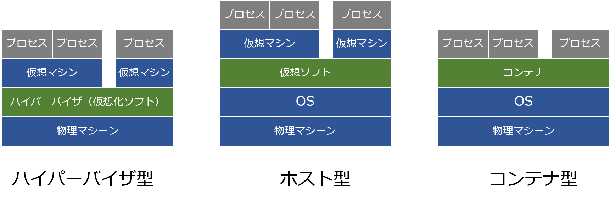

- [Dockerとは](#dockerとは)
    - [コンテナ型](#コンテナ型)
      - [コンテナ仮想化のメリット](#コンテナ仮想化のメリット)
    - [alpineLinuxとは](#alpinelinuxとは)
      - [比較 docker image](#比較-docker-image)
      - [パッケージマネージャ「apk」](#パッケージマネージャapk)

# Dockerとは
Docker社が開発している、コンテナ型の仮想環境を作成、配布、実行するためのプラットフォーム。
コンテナ型のアプリケーション実行環境のこと。Linux上で動作する。（WindowsやMacでは裏でLinuxの仮想環境が構築されている）

[Dockerハンズオン](https://shimo5.me/post/2020-09-07/)

### コンテナ型

現在の主流。アプリケーション・ミドルウェア・OSなどのインフラ環境を一つのコンテナとしてまとめる。それぞれのコンテナがホストOSを共有して稼働するため、他の仮想化と比べるとサーバの起動や処理なども高速。ホストOSと異なるOSのコンテナを作ることができない。



仮想化ソフトウェアの例：Dockerなど

#### コンテナ仮想化のメリット

- ビルド、デプロイも高速
- オーバーヘッドが少ない
- プラットフォームやハードウェアからの隔離環境
- ラップトップで動いているものをそのままサーバに持っていける

####特徴
- 開発環境を共有できる
- Docker Hubと呼ばれるレジストリがある
- ホストがライブラリやミドルウェアで汚れない

dockerが利用されているサービス
AbemaTV・アメーバブログ・Pokemon Goなど

### alpineLinuxとは
組み込み系でよく使われているBusyBoxとmuslをベースにしたLinuxディストリビューション。
軽量でセキュアな点が特徴。

#### 比較 docker image

```
ubuntu 64.2MB
alpine 5.55MB
centos 220MB
```
`docker pull push` などの時間が短縮される。

#### パッケージマネージャ「apk」